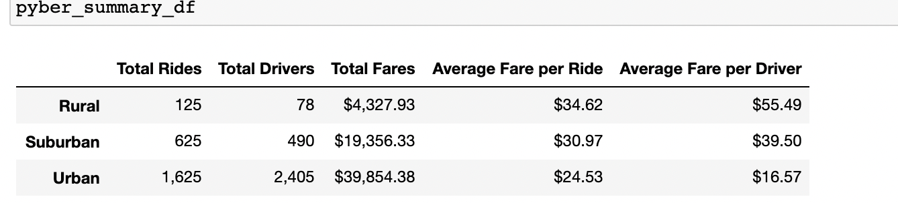
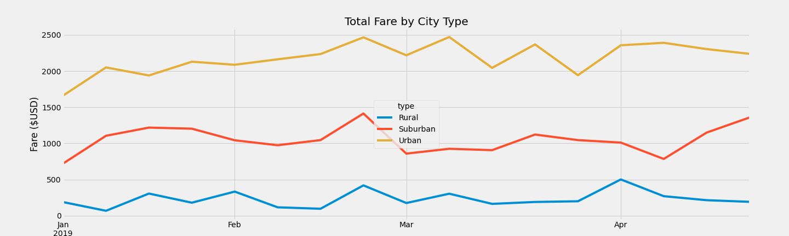

# PyBer_Analysis

## Overview of Analysis

The initial analysis that we ran for Pyber allowed us to view many trends within our dataframe, we were able to categorize city types, drivers, and fares. You can find those trends in the PyBer.ipynb file withing this folder. While the analysis proved very useful, it is always good to summarize our findings when unloading that amount of information to those who want to draw a quick analysis from the data. In this Challenge I needed to summarize our findings in terms of ride sharing data by city type and finally visualize this information in terms of total weekly fares for each city type. All of this will be helpful in aiding Pyber to make informative decisions on ride access and affortability. 

## Results

### Differences in ride sharing data between the 3 city types

  In our "pyber_summary_df" image found below there is a glaring anomally between our "Total Rides" and "Total Drivers". We see that the rural and suburban city types both had more rides than drivers. This is a startling trend that indicates that we have more demand than supply. 

  The Urban data set had far more drivers than rides, with almost 800 more registered drivers than total rides. While the urban city type was far more successful in terms of "Total Fares", the averages per ride and driver was not quite as impressive. 

#### Key Figures to note about our summary:

- Highest Total Fares - "Urban : $39,854"
- Highest Average Fare per Ride - "Rural: $34.62"
- Highest Average Fare per Driver - "Rural: $55.49"

### Line Chart of Total Fares 

Our line chart below shows us the total fares by the city type. The one thing that sticks out about this visualization is how insusceptible our rural city type was to change over time. Please view the image below. 

Considering that our rural city type had the least amount of data, we would expect see more fluctuation to our plot with time. Our expected trend based on volume does not come true with the rural city types, the question has to become, why is the rural city less volatile to the test of time? We see most of our major dips and peaks with our urban and suburban data type. 

## Summary

Based on the information we were able to accumulate with this analysis, it is clear where Pyber can make adjustments to improve accessibility and affortability. 

### Table Analysis

With our summary dataframe, we can see that the fare price for rural city type was carried over our most expensive fares in terms of average fare per ride. This can be due to geography in terms of how spaced out things are in the rural part of town. This data shows that there is not much accessibility to our drivers. 

- Better recruitement of drivers in rural cities would allow us to solve the accessibility issue. 

- Better ride to driver matching could also be of use too if we want to decrease the average distance between fares. This would in turn increase accessibility and affordability. 

However, looking at the data the high 1.6 (125/78) ride to driver ratio is the major source of the high prices for rural areas. The ride to driver ratio creates two issues, in terms of accessibility and affortability. 

- A combination of more drivers and better advertising of our platform to consumers, would increase the affortability of Pyber. 

